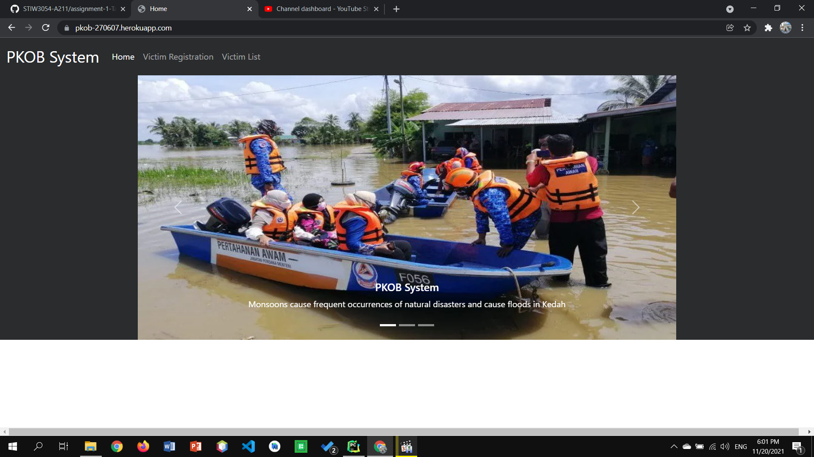
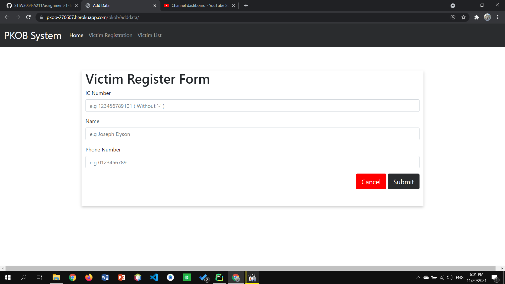
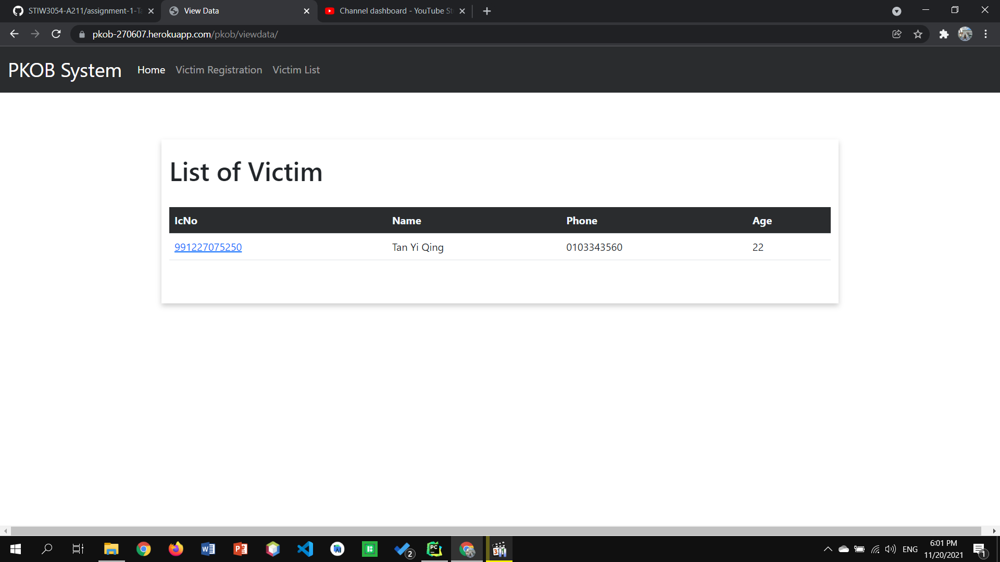
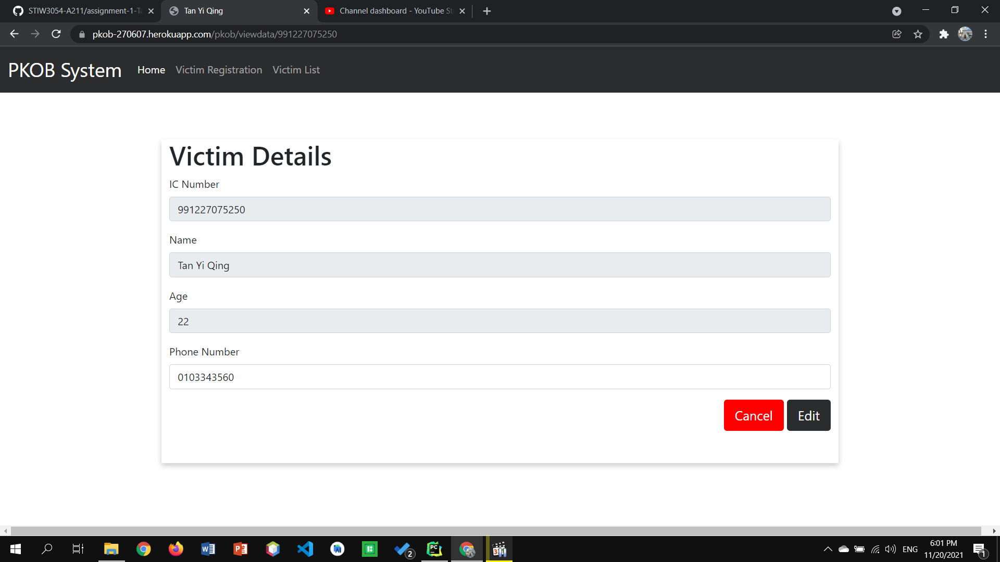

## Requirements for Group Project
[Read the instruction](https://github.com/STIW3054-A211/e-sulam/blob/main/Assignment-1.md)

## Your Info:
1. Matric Number & Name & Photo & Phone Number

|             Name             | Matric No |  Phone Number   |                    Image                   |
| :--------------------------: | :-------: | :-------------: |  :---------------------------------------: |
|         Tan Yi Qing          |  270607   |  +60103373137   |      |

2. Other related info (if any)

## Introduction

Pusat Kawalan Operasi Bencana (PKOB) is a centralized system that can help the penghulu of a district quickly engage in post-disaster relief operations. 

In this assignment 1, PKOB system initial prototype will be developed. This initial prototype contains add, edit, and view details function. With this PKOB system initial prototype, victims can register their identity on this system which they can easily request for assistance.

Furthermore, there will also a victim list for the admin to easily manage the victims data. The victim list will contain details such as IC Number, Name, Phone Number, and Age. Age is the filed that will calculated automatically by the algorithm, based on the IC Number.

## Result/Output (Screenshot of the output)

## Youtube Presentation
https://youtu.be/RbnnXKbQ8rk

https://pkob-270607.herokuapp.com/

## List of Python packages (including the version) used for this system
|Package   | Version|
|----------| -------|
|asgiref   | 3.4.1  |
|Django    | 3.2.8  |
|gunicorn  | 20.1.0 |
|pip       | 21.1.2 |
|pytz      | 2021.3 |
|setuptools| 57.0.0 |
|sqlparse  | 0.4.2  |
|wheel     | 0.36.2 |

## References (Not less than 10)
11 Save Html Form Data To Database using Python & Django. (2020, April 7). [Video]. YouTube. https://www.youtube.com/watch?v=WGZtYw9SFfY

Dhillon, C. W. A. (2020, April 20). 19 Django Edit User Profile Part 1 [Video]. YouTube. https://www.youtube.com/watch?v=y1X8cKg6qXQ&feature=youtu.be

Date And Time Functions. (n.d.). SQLite. https://www.sqlite.org/lang_datefunc.html

Datetime current year and month in Python. (2015, January 28). Stack Overflow. https://stackoverflow.com/questions/28189442/datetime-current-year-and-month-in-python

Django add data to database from HTML page. (2019, December 7). Stack Overflow. https://stackoverflow.com/questions/59225576/django-add-data-to-database-from-html-page

How do I get the current date and current time only respectively in Django? (2012, August 19). Stack Overflow. https://stackoverflow.com/questions/12030187/how-do-i-get-the-current-date-and-current-time-only-respectively-in-django

How to check if data already exists in the table using django. (2019, June 26). Stack Overflow. https://stackoverflow.com/questions/56782044/how-to-check-if-data-already-exists-in-the-table-using-django

How to Display Only the Date from a DateTimeField Object in Django. (n.d.). Learn about Electronics. http://www.learningaboutelectronics.com/Articles/How-to-display-only-the-date-from-a-DateTimeField-object-in-Django.php

How to parse string dates with 2-digit year? (2013, May 17). Stack Overflow. https://stackoverflow.com/questions/16600548/how-to-parse-string-dates-with-2-digit-year

how to write a use defined function inside django models.py? (2019, April 25). Stack Overflow. https://stackoverflow.com/questions/55843976/how-to-write-a-use-defined-function-inside-django-models-py

In django do models have a default timestamp field? (2011, November 4). Stack Overflow. https://stackoverflow.com/questions/8016412/in-django-do-models-have-a-default-timestamp-field

Kaushik, N. (2017, August 29). How to check if a date is valid or not in python. CodeVsColor. https://www.codevscolor.com/date-valid-check-python

Kumar, A. (2020, May 14). secondproject. Bitbucket. https://bitbucket.org/sts_amandeepkaur/secondproject/src/master/